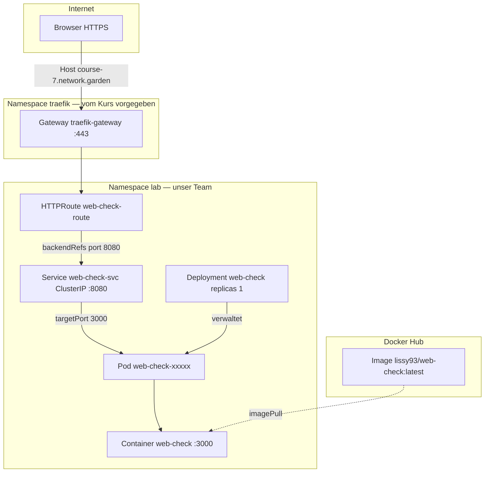
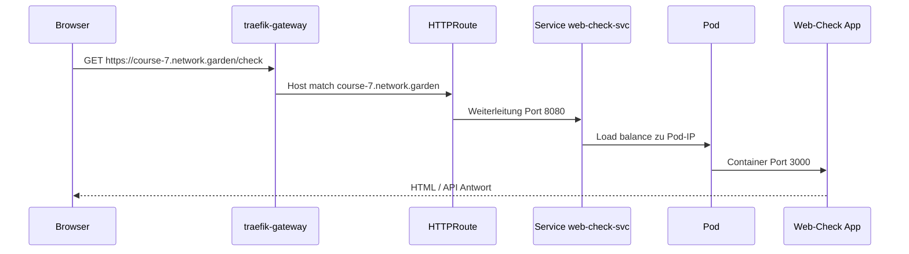
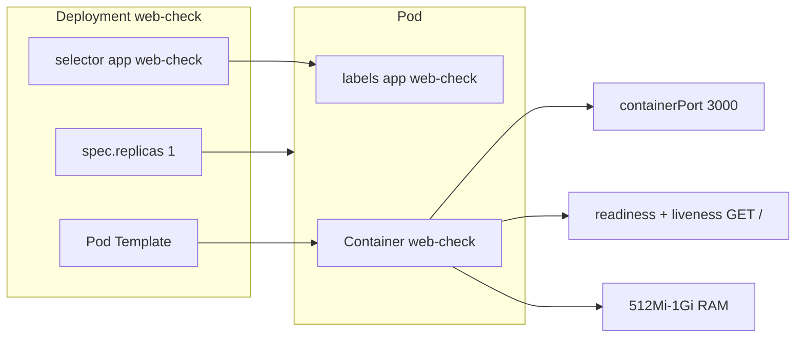
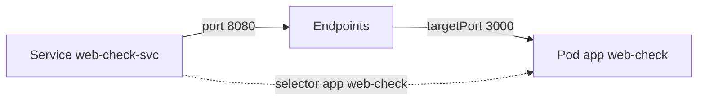
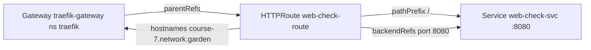
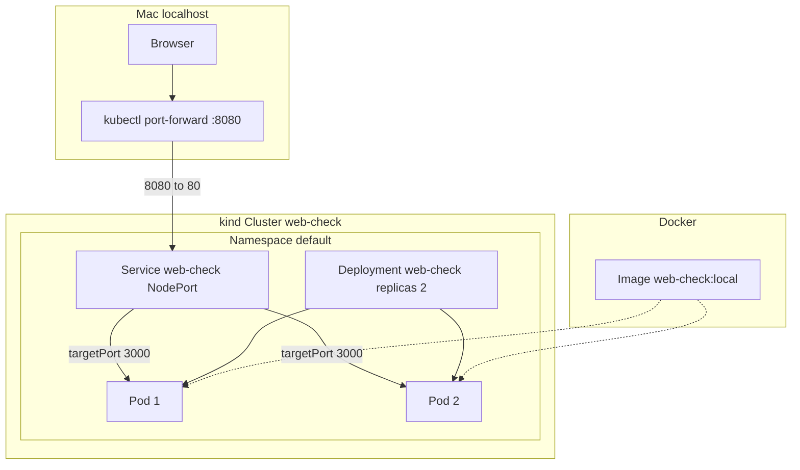
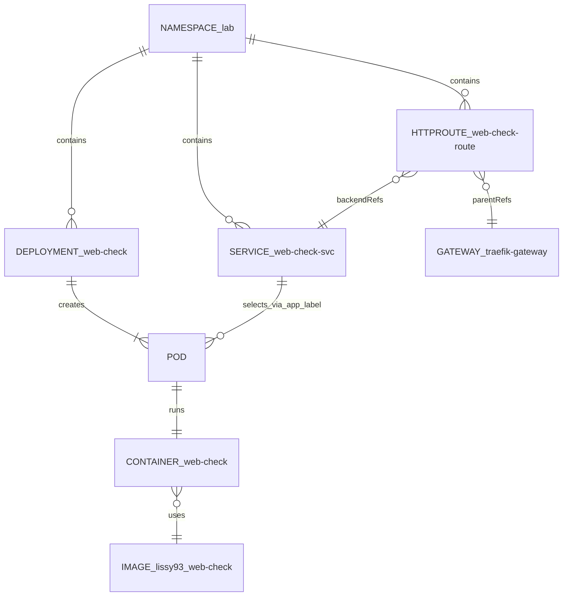

# Kubernetes-Architektur — Web-Check Schulprojekt

Technische Dokumentation auf **Kubernetes-Ebene**: welche Ressourcen existieren, wie sie zusammenhängen, und wer im Team was umgesetzt hat.

**Team:** lad · lob · las · bls  
**GitHub:** https://github.com/leteffe/web-check-k8s  
**Live:** https://course-7.network.garden/check

---

## Übersicht: Zwei Umgebungen

| | **course-7.network.garden** (Präsentation) | **Lokal** (`./start.sh`) |
|---|---------------------------------------------|--------------------------|
| Cluster | Remote (Kurs) | kind `web-check` |
| Manifeste | `k8s/network-garden/` | `k8s/deployment.yaml`, `k8s/service.yaml` |
| Namespace | `lab` | `default` |
| Image | `lissy93/web-check:latest` | `web-check:local` |
| Zugriff | HTTPRoute + Gateway (HTTPS) | NodePort + Port-Forward |
| Replicas | 1 | 2 |

Die **Präsentation** nutzt die linke Spalte. Details unten.

---

## Architektur auf course-7.network.garden

### Gesamt-Diagramm



### Request-Flow (eine Anfrage)



---

## Kubernetes-Ressourcen (course-7)

### Ressourcen-Tabelle

| Kind | Name | Namespace | Zweck | Datei | Team |
|------|------|-----------|-------|-------|------|
| **Namespace** | `lab` | — | Isolation unserer App | [`namespace.yaml`](k8s/network-garden/namespace.yaml) | las |
| **Deployment** | `web-check` | `lab` | 1 Pod, Image, Probes, Limits | [`deployment.yaml`](k8s/network-garden/deployment.yaml) | lob |
| **Pod** | `web-check-…` | `lab` | Laufende App-Instanz | (vom Deployment erzeugt) | lob |
| **Service** | `web-check-svc` | `lab` | Stabile IP, Port 8080→3000 | [`service.yaml`](k8s/network-garden/service.yaml) | las |
| **HTTPRoute** | `web-check-route` | `lab` | Domain → Service | [`httproute.yaml`](k8s/network-garden/httproute.yaml) | las |
| **Gateway** | `traefik-gateway` | `traefik` | HTTPS-Eingang (vorgegeben) | — (Kurs-Cluster) | — |

### Deployment → Pod



**Was das Deployment macht:**
- Hält **1 Pod** mit Label `app: web-check` am Laufen
- Startet Container aus Image `lissy93/web-check:latest`
- **Readiness-Probe:** Pod erst `Ready`, wenn HTTP auf `/` antwortet (nach 20s)
- **Liveness-Probe:** Neustart bei hängender App (nach 40s)
- **Ressourcen:** min. 512Mi RAM, max. 1Gi

### Service → Pod (Selektor)



| Service-Feld | Wert | Bedeutung |
|--------------|------|-----------|
| `type` | `ClusterIP` | Nur intern im Cluster erreichbar |
| `port` | `8080` | Port des Service (für HTTPRoute) |
| `targetPort` | `3000` | Port im Container |
| `selector` | `app: web-check` | Verbindet zu Pods mit diesem Label |

### HTTPRoute → Gateway → Service



| HTTPRoute-Feld | Wert |
|----------------|------|
| `parentRefs` | Gateway `traefik-gateway` in `traefik` |
| `hostnames` | `course-7.network.garden` |
| `matches` | Pfad `/` (Prefix) |
| `backendRefs` | Service `web-check-svc`, Port `8080` |

---

## Architektur lokal (kind)



| Kind | Name | Namespace | Besonderheit |
|------|------|-----------|--------------|
| Deployment | `web-check` | `default` | 2 Replicas |
| Service | `web-check` | `default` | NodePort `30080`, Port 80→3000 |
| HTTPRoute | — | — | Nicht vorhanden (kein Gateway auf kind) |

---

## Was wir getan haben (Schritt für Schritt)

### 1. lad — Container-Image

| Aktion | Kubernetes-Bezug |
|--------|------------------|
| `Dockerfile` gebaut | Definiert, was **im Container** läuft |
| Lokal: `web-check:local` | Wird im **Pod** als `image` referenziert |
| Remote: `lissy93/web-check` | Öffentliches Image — Cluster **pullt** es in den Pod |

Ohne Image kein Pod → `ImagePullBackOff`.

### 2. lob — Deployment & Pods

```bash
kubectl apply -f k8s/network-garden/deployment.yaml
kubectl get pods -n lab -l app=web-check
kubectl describe deployment web-check -n lab
```

Ergebnis im Cluster:
- **ReplicaSet** `web-check-…` (vom Deployment verwaltet)
- **Pod(s)** mit Status `Running`, `READY 1/1`

### 3. las — Service & HTTPRoute

```bash
kubectl apply -f k8s/network-garden/service.yaml
kubectl apply -f k8s/network-garden/httproute.yaml
kubectl get endpoints web-check-svc -n lab
kubectl get httproute web-check-route -n lab
```

Ergebnis:
- **Endpoints** zeigen Pod-IP(s) hinter dem Service
- **HTTPRoute** bindet Domain an Service

### 4. bls — Verifikation

```bash
kubectl get all,httproute -n lab -l app=web-check
kubectl logs -n lab -l app=web-check --tail=20
# Browser: https://course-7.network.garden/check
```

---

## Objekt-Beziehungen (Kubernetes-API)



---

## Ports (Zusammenfassung)

### course-7.network.garden

```
HTTPS :443  →  Gateway traefik-gateway
                    ↓
              HTTPRoute (Host + Path /)
                    ↓
              Service web-check-svc :8080
                    ↓
              Pod containerPort :3000  →  Web-Check App
```

### Lokal (Port-Forward)

```
localhost :8080  →  Service web-check :80  →  Pod :3000
```

---

## Inspect-Befehle (Präsentation)

```bash
export KUBECONFIG=/pfad/zu/course-7.config

# Alle unsere Ressourcen
kubectl get all,httproute -n lab -l app=web-check

# Einzeln erklären
kubectl get namespace lab
kubectl get deployment web-check -n lab -o wide
kubectl get pods -n lab -l app=web-check -o wide
kubectl describe pod -n lab -l app=web-check
kubectl get svc web-check-svc -n lab
kubectl get endpoints web-check-svc -n lab
kubectl get httproute web-check-route -n lab -o yaml
kubectl logs -n lab -l app=web-check --tail=30

# Gateway (Kurs-Infrastruktur)
kubectl get gateway traefik-gateway -n traefik
```

---

## Deploy & Aufräumen

```bash
# Alles deployen
kubectl apply -f k8s/network-garden/

# Einzeln
kubectl apply -f k8s/network-garden/namespace.yaml
kubectl apply -f k8s/network-garden/deployment.yaml
kubectl apply -f k8s/network-garden/service.yaml
kubectl apply -f k8s/network-garden/httproute.yaml

# Entfernen
kubectl delete -f k8s/network-garden/
```

---

## Siehe auch

| Dokument | Inhalt |
|----------|--------|
| [NETWORK_GARDEN.md](NETWORK_GARDEN.md) | Deploy-Anleitung course-7 |
| [k8s/network-garden/](k8s/network-garden/) | YAML-Manifeste |
| [PRÄSENTATION.md](PRÄSENTATION.md) | Folien & Demo |
| [RESULTS_lob.md](RESULTS_lob.md) · [RESULTS_las.md](RESULTS_las.md) | Durchgeführte Schritte |
