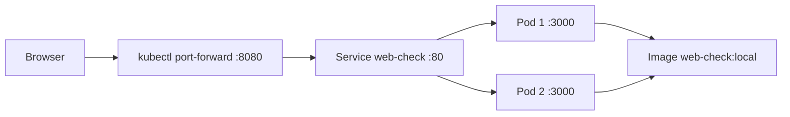

# Architektur: Web-Check auf Kubernetes

Das Gruppenprojekt stellt Web-Check als Container in einem lokalen Kubernetes-Cluster bereit. Die Konfiguration bleibt absichtlich portabel: Sie enthält weder eine externe Domain noch cluster- oder nutzerspezifische Zugänge.



## Kubernetes-Ressourcen

| Ressource | Datei | Aufgabe |
|---|---|---|
| Deployment | [k8s/deployment.yaml](k8s/deployment.yaml) | Hält zwei Web-Check-Pods mit identischem Label am Laufen. |
| Service | [k8s/service.yaml](k8s/service.yaml) | Leitet Anfragen auf Port 80 an Port 3000 der Pods weiter. |

### Deployment

Das Deployment definiert das lokale Image `web-check:local`, zwei Replikate sowie Readiness- und Liveness-Probes. Kubernetes ersetzt Pods bei Ausfällen und stellt die gewünschte Anzahl Replikate wieder her.

CPU- und Speicher-Requests bzw. -Limits verhindern, dass ein einzelner Container unbegrenzt Ressourcen belegt.

### Service

Der Service verwendet das Label `app: web-check`, um die Pods des Deployments zu finden. Über `kubectl port-forward svc/web-check 8080:80` wird er für die lokale Demo erreichbar.

## Datenfluss

1. Ein Browser verbindet sich mit `localhost:8080`.
2. `kubectl port-forward` leitet die Anfrage an den Service weiter.
3. Der Service verteilt die Anfrage auf einen passenden Pod.
4. Web-Check antwortet aus dem Container auf Port 3000.

## Validierung

```bash
kubectl apply --dry-run=client -f k8s/
kubectl get deployment,service -l app=web-check
kubectl get pods -l app=web-check
kubectl scale deployment web-check --replicas=3
```

Nach dem Skalieren kann die Replikazahl wieder auf zwei zurückgesetzt werden. Eine Schritt-für-Schritt-Anleitung steht in [k8s/README.md](k8s/README.md).
