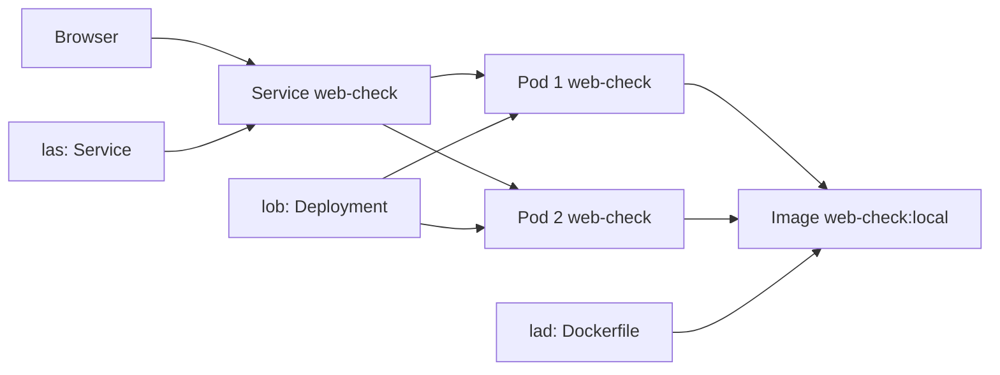
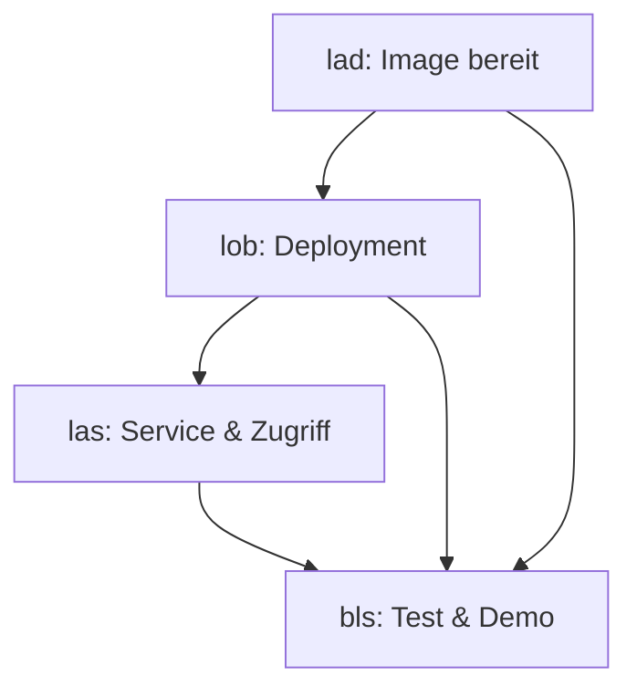

# Kubernetes-Schulprojekt: Web-Check auf Kubernetes

## Projektziel

Die **Web-Check**-App (OSINT-Tool zur Analyse von Websites) soll containerisiert auf **Kubernetes** laufen. Das Team richtet Image, Manifeste und Zugriff ein, testet den Betrieb und präsentiert das Ergebnis in einer **10–15 Minuten Demo**.

**Basis im Repo:**

| Datei | Relevanz |
|-------|----------|
| [`package.json`](package.json) | App `web-check`, Start mit `yarn start` |
| [`Dockerfile`](Dockerfile) | Multi-Stage-Build, Node 22, Port **3000** |
| [`docker-compose.yml`](docker-compose.yml) | Referenz: Image `lissy93/web-check`, Port `3000:3000` |

**Empfohlene lokale Umgebung:** [minikube](https://minikube.sigs.k8s.io/), [kind](https://kind.sigs.k8s.io/) oder Docker Desktop mit Kubernetes.

**Schnellstart (Klonen / Neustart):** [README.md](README.md) — `./start.sh`

**Dokumentation (umgesetzt):**

| Datei | Inhalt |
|-------|--------|
| [TASKS_lad.md](TASKS_lad.md) · [RESULTS_lad.md](RESULTS_lad.md) | Aufgaben & Ergebnisse — Docker/Image |
| [TASKS_lob.md](TASKS_lob.md) · [RESULTS_lob.md](RESULTS_lob.md) | Aufgaben & Ergebnisse — Deployment |
| [TASKS_las.md](TASKS_las.md) · [RESULTS_las.md](RESULTS_las.md) | Aufgaben & Ergebnisse — Service |
| [TASKS_bls.md](TASKS_bls.md) · [RESULTS_bls.md](RESULTS_bls.md) | Aufgaben & Ergebnisse — Tests/Demo |
| [PRÄSENTATION.md](PRÄSENTATION.md) | Folien & Sprechertexte (10–15 Min) |
| [DEMO_SKRIPT.md](DEMO_SKRIPT.md) | Live-Demo-Ablauf |
| [k8s/](k8s/) | Manifeste, README, Troubleshooting |

---

## Team & Aufgabenverteilung

### lad — Docker & Image

**Verantwortung:** Container-Image bauen, lokal testen, Image für Kubernetes bereitstellen.

| # | Aufgabe | Details |
|---|---------|---------|
| 1 | Dockerfile verstehen | Multi-Stage-Build, Chromium/Puppeteer, `EXPOSE 3000`, `CMD yarn start` |
| 2 | Image bauen | `docker build -t web-check:local .` |
| 3 | Container lokal testen | `docker run -p 3000:3000 web-check:local` → http://localhost:3000 |
| 4 | Image ins Cluster laden | z. B. minikube: `eval $(minikube docker-env)` und dort bauen, oder `minikube image load web-check:local` |
| 5 | Kurze Doku | In `k8s/README.md`: Build- und Load-Befehle für das Team |

**Lieferobjekte:** funktionierendes lokales Image, dokumentierte Build-Schritte.

---

### lob — Deployment & Pods

**Verantwortung:** Kubernetes-Deployment erstellen und Pods betreiben.

| # | Aufgabe | Details |
|---|---------|---------|
| 1 | `k8s/deployment.yaml` anlegen | `apiVersion: apps/v1`, `kind: Deployment`, Name z. B. `web-check` |
| 2 | Container-Spec | Image `web-check:local` (oder Team-Tag), `containerPort: 3000` |
| 3 | Replicas & Labels | z. B. `replicas: 2`, Labels `app: web-check` für Service-Selektor |
| 4 | Ressourcen (optional) | `resources.requests/limits` für CPU/Memory |
| 5 | Deploy & prüfen | `kubectl apply -f k8s/deployment.yaml`, `kubectl get pods`, `kubectl describe pod …` |
| 6 | Skalierung zeigen | `kubectl scale deployment web-check --replicas=3` (für Demo vorbereiten) |

**Lieferobjekte:** [`k8s/deployment.yaml`](k8s/deployment.yaml), laufende Pods im Cluster.

**Beispiel-Snippet (Ausgangspunkt):**

```yaml
apiVersion: apps/v1
kind: Deployment
metadata:
  name: web-check
  labels:
    app: web-check
spec:
  replicas: 2
  selector:
    matchLabels:
      app: web-check
  template:
    metadata:
      labels:
        app: web-check
    spec:
      containers:
        - name: web-check
          image: web-check:local
          imagePullPolicy: IfNotPresent
          ports:
            - containerPort: 3000
```

---

### las — Service & Zugriff

**Verantwortung:** Netzwerk-Zugriff auf die App im Cluster ermöglichen.

| # | Aufgabe | Details |
|---|---------|---------|
| 1 | `k8s/service.yaml` anlegen | `kind: Service`, Selector `app: web-check`, Port 80 → Target 3000 |
| 2 | Service-Typ wählen | `NodePort` (einfach für Schul-Demo) oder `ClusterIP` + Port-Forward |
| 3 | Zugriff testen | `kubectl port-forward svc/web-check 8080:80` oder NodePort-URL |
| 4 | Optional: Ingress | `k8s/ingress.yaml` falls Ingress-Controller vorhanden (minikube: `minikube addons enable ingress`) |
| 5 | Zugriffs-Doku | URL/Befehle in `k8s/README.md` für die Präsentation |

**Lieferobjekte:** [`k8s/service.yaml`](k8s/service.yaml), optional [`k8s/ingress.yaml`](k8s/ingress.yaml), dokumentierter Zugriff im Browser.

**Beispiel-Snippet Service:**

```yaml
apiVersion: v1
kind: Service
metadata:
  name: web-check
spec:
  type: NodePort
  selector:
    app: web-check
  ports:
    - port: 80
      targetPort: 3000
      nodePort: 30080
```

---

### bls — Tests, Troubleshooting & Präsentation

**Verantwortung:** End-to-End-Test, Fehlerbilder kennen, Demo und Folien vorbereiten.

| # | Aufgabe | Details |
|---|---------|---------|
| 1 | Smoke-Test | App im Browser öffnen, eine Domain analysieren (z. B. `example.com`) |
| 2 | kubectl-Checks | `kubectl get all -l app=web-check`, Logs: `kubectl logs -l app=web-check` |
| 3 | Troubleshooting-Sheet | Häufige Probleme: ImagePullBackOff, CrashLoopBackOff, Port falsch, Image nicht im Cluster |
| 4 | Demo-Skript | Schritt-für-Schritt-Ablauf für 10–15 Min (siehe unten) |
| 5 | Folien / Sprecher | Wer spricht wann; Kubernetes-Begriffe kurz erklären |
| 6 | Backup-Plan | Screenshots oder Video, falls Live-Demo scheitert |

**Lieferobjekte:** Testprotokoll (kurz), Demo-Skript, Präsentationsfolien.

---

## Gemeinsame Artefakte (Zielstruktur)

```
k8s/
├── deployment.yaml    # lob
├── service.yaml       # las
├── ingress.yaml       # las (optional)
└── README.md          # alle: Befehle zum Deployen & Zugriff
```

### Wichtige kubectl-Befehle (für `k8s/README.md`)

```bash
# Namespace (optional)
kubectl create namespace web-check
kubectl config set-context --current --namespace=web-check

# Deploy
kubectl apply -f k8s/

# Status
kubectl get deployments,pods,services -l app=web-check
kubectl describe deployment web-check

# Logs
kubectl logs -l app=web-check --tail=50

# Zugriff (wenn ClusterIP)
kubectl port-forward svc/web-check 8080:80
# Browser: http://localhost:8080

# Aufräumen
kubectl delete -f k8s/
```

---

## Zeitplan (Vorschlag)

| Phase | Dauer | Wer | Inhalt |
|-------|-------|-----|--------|
| 1 | 1–2 h | lad | Image bauen & lokal testen |
| 2 | 2 h | lob | Deployment schreiben & Pods zum Laufen bringen |
| 3 | 1–2 h | las | Service, Zugriff, optional Ingress |
| 4 | 1 h | alle | Integration: `kubectl apply -f k8s/` gemeinsam |
| 5 | 1–2 h | bls | Tests, Demo proben, Folien |
| 6 | 15 min | alle | Präsentation & Live-Demo |

---

## Präsentation & Demo (10–15 Minuten)

### Ablauf (wer spricht)

| Zeit | Sprecher | Inhalt |
|------|----------|--------|
| 0:00–1:30 | **bls** | Begrüssung, Projektziel: Web-Check auf Kubernetes |
| 1:30–3:00 | **lad** | Warum Container? Kurz Dockerfile & `docker run -p 3000:3000` |
| 3:00–5:00 | **lob** | Deployment, Pods, Replicas — `kubectl get pods` live |
| 5:00–7:00 | **las** | Service, Ports 80→3000 — Zugriff im Browser zeigen |
| 7:00–10:00 | **bls** | Live-Demo: Website in Web-Check analysieren |
| 10:00–12:00 | **lob** | Skalierung: `kubectl scale …` oder zweiten Pod zeigen |
| 12:00–14:00 | **las** | Architektur-Diagramm (siehe unten) |
| 14:00–15:00 | **bls** | Fazit, Lessons Learned, Q&A |

### Live-Demo Checkliste (bls moderiert)

1. Terminal: `kubectl get pods,services` — alles `Running` / Service hat Port
2. Browser: App öffnen (Port-Forward oder NodePort)
3. Domain eingeben (z. B. `wikipedia.org`) — Ergebnis zeigen
4. Terminal: `kubectl logs -l app=web-check --tail=20`
5. Optional: Pod löschen → Kubernetes startet neuen Pod (`kubectl delete pod …`)

### Kubernetes-Begriffe (kurz erklären)

| Begriff | Erklärung |
|---------|-----------|
| **Pod** | Kleinste Einheit; ein oder mehrere Container |
| **Deployment** | Verwaltet Pods, Replicas, Updates |
| **Service** | Stabile IP/Port zum Erreichen der Pods |
| **NodePort / Port-Forward** | Zugriff von ausserhalb des Clusters |
| **Image** | Container-Vorlage aus Dockerfile |

### Architektur (für Folie)



---

## Bewertungskriterien (Orientierung)

- Kubernetes-Ressourcen korrekt erklärt (Pod, Deployment, Service)
- App läuft im Cluster und ist im Browser erreichbar
- Teamarbeit sichtbar: jede Person hat erkennbaren Beitrag
- Live-Demo oder nachvollziehbare Dokumentation (`k8s/README.md`)
- Kurze Reflexion: Was war schwierig? (Image im Cluster, Ports, Ressourcen)

---

## Abhängigkeiten zwischen Teammitgliedern



**Reihenfolge:** lad → lob → las → bls (mit frühem gemeinsamen Abstimmungstermin nach Phase 1).

---

## Quick Reference: Von docker-compose zu Kubernetes

| docker-compose | Kubernetes |
|----------------|------------|
| `image: lissy93/web-check` | `image: web-check:local` im Deployment |
| `ports: 3000:3000` | Service `port/targetPort` + NodePort oder Port-Forward |
| `restart: unless-stopped` | Deployment `replicas` + Restart-Policy der Pods |
| `container_name: Web-Check` | Deployment/Service Name `web-check` |

---

*Stand: Schulprojekt Web-Check × Kubernetes — Aufgaben für **lad**, **lob**, **las**, **bls**.*
