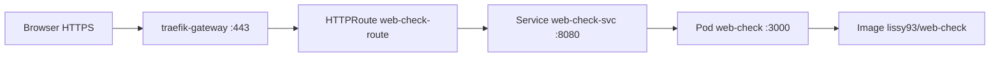

# Web-Check auf course-7.network.garden

Deployment der Schulprojekt-App auf dem **Kurs-Cluster** (network.garden), nicht lokal mit kind.

**Live:** https://course-7.network.garden/check

**Team (Setup auf der Plattform):** **lad** · **lob** · **las** · **bls**

**GitHub:** https://github.com/leteffe/web-check-k8s

**Kubernetes-Architektur (Diagramme):** [KUBERNETES_ARCHITEKTUR.md](KUBERNETES_ARCHITEKTUR.md)

Referenz-Umgebung: [`mil_cyber_k8s`](../../mil_cyber_k8s) — dort sind Kubeconfig, Domain und HTTPRoute-Muster dokumentiert.

---

## Team & Repository

| | |
|---|---|
| **Live-URL** | https://course-7.network.garden/check |
| **Team** | **lad** (Docker/Image) · **lob** (Deployment) · **las** (Service/HTTPRoute) · **bls** (Tests/Demo) |
| **GitHub** | [github.com/leteffe/web-check-k8s](https://github.com/leteffe/web-check-k8s) |

Dieses Setup auf network.garden wurde vom Team **lad**, **lob**, **las** und **bls** umgesetzt. Code, Manifeste und Dokumentation liegen im GitHub-Repository.

---

## URL

Nach erfolgreichem Deploy:

**https://course-7.network.garden/check**

Die Startseite `/` leitet per HTTP 302 auf `/check` weiter — für die App direkt `/check` öffnen.

(HTTPS über Gateway `traefik-gateway`, Port 443)

---

## Unterschied zu lokalem Setup (`./start.sh`)

| | Lokal (kind) | course-7.network.garden |
|---|--------------|-------------------------|
| Cluster | `kind-web-check` auf dem Mac | Remote-Cluster via Kubeconfig |
| Image | `web-check:local` (selbst gebaut) | `lissy93/web-check:latest` (Docker Hub) |
| Zugriff | `kubectl port-forward` → :8080 | **HTTPRoute** → öffentliche Domain |
| Service-Typ | NodePort | ClusterIP |
| Namespace | `default` | **`lab`** |

**Warum anderes Image?** Der Remote-Cluster kann dein lokales Image `web-check:local` nicht laden. Das öffentliche Image `lissy93/web-check` entspricht dem Eintrag in [`docker-compose.yml`](../docker-compose.yml).

---

## Voraussetzungen

- Kubeconfig: `mil_cyber_k8s/lad/course-7.config` (oder Kopie im Team)
- `kubectl` installiert
- Namespace `lab` auf dem Cluster (vom Kurs vorgegeben)

```bash
export KUBECONFIG=/Users/latifadili/mil_cyber_k8s/lad/course-7.config
kubectl config set-context --current --namespace=lab
kubectl get nodes
```

Der Namespace `lab` wird mit deployt ([`namespace.yaml`](k8s/network-garden/namespace.yaml)), falls er noch nicht existiert.

Ohne `KUBECONFIG` versucht kubectl `localhost:8080` → **connection refused**.

---

## Deploy (ein Befehl)

```bash
export KUBECONFIG=/Users/latifadili/mil_cyber_k8s/lad/course-7.config
kubectl config set-context --current --namespace=lab

kubectl apply -f k8s/network-garden/
kubectl rollout status deployment/web-check -n lab --timeout=180s
kubectl get pods,svc,httproute -n lab -l app=web-check
```

**Browser:** https://course-7.network.garden/check

---

## Architektur



Entspricht dem Kurs-Muster (Exercise 1.6):

```
Browser :443 → Gateway → HTTPRoute → Service :8080 → Pod :3000
```

Vergleich im Kurs-Repo: `mil_cyber_k8s/lad/k8s_object_mgmt_learner_lab/webserver.yaml`

---

## Manifeste

| Datei | Inhalt |
|-------|--------|
| [`namespace.yaml`](namespace.yaml) | Namespace `lab` (wird bei Bedarf angelegt) |
| [`deployment.yaml`](deployment.yaml) | 1× Pod, Image `lissy93/web-check`, Port 3000 |
| [`service.yaml`](service.yaml) | ClusterIP, Port 8080 → Target 3000 |
| [`httproute.yaml`](httproute.yaml) | Host `course-7.network.garden`, Parent `traefik-gateway` |

---

## Host-Konflikt beachten

Pro Domain und Pfad `/` kann nur **ein** HTTPRoute (bzw. eine App) aktiv sein.

Falls noch die Kurs-Übung `webserver-route` läuft:

```bash
kubectl delete httproute webserver-route -n lab
# oder webserver-Deployment entfernen, wenn nicht mehr nötig
kubectl delete -f /path/to/webserver.yaml
```

Dann erneut:

```bash
kubectl apply -f k8s/network-garden/
```

---

## Prüfen & Debuggen

```bash
export KUBECONFIG=/Users/latifadili/mil_cyber_k8s/lad/course-7.config

kubectl get pods -n lab -l app=web-check
kubectl logs -n lab -l app=web-check --tail=50
kubectl describe httproute web-check-route -n lab
curl -sI https://course-7.network.garden/check
```

| Symptom | Lösung |
|---------|--------|
| `connection refused` (kubectl) | `export KUBECONFIG=.../course-7.config` |
| `ImagePullBackOff` | Image-Name prüfen; Netzwerk zum Docker Hub |
| 404 / falsche Seite | Anderen HTTPRoute/Ingress auf gleicher Domain löschen |
| Pod `Pending` | `kubectl describe pod` — evtl. Ressourcen-Limits senken |

---

## Aufräumen

```bash
kubectl delete -f k8s/network-garden/
```

---

## Eigenes Image (optional)

Wenn ihr das selbst gebaute Image nutzen wollt, muss es in eine **Registry**, die der Cluster erreicht (z. B. GitLab Container Registry, Docker Hub):

```bash
docker build -t <registry>/web-check:team .
docker push <registry>/web-check:team
```

Dann in `deployment.yaml` das `image:` anpassen.

---

## Team-Zuordnung

| Person | Aufgabe auf network.garden |
|--------|----------------------------|
| **lad** | Image-Wahl / optional Push in Registry |
| **lob** | `deployment.yaml` anwenden, Pods prüfen |
| **las** | `service.yaml` + `httproute.yaml`, Domain testen |
| **bls** | https://course-7.network.garden/check im Browser demonstrieren |

Siehe auch [RESULTS_*.md](../RESULTS_las.md) für lokale Ergebnisse; auf dem Kurs-Cluster gelten die Befehle in diesem Dokument.
