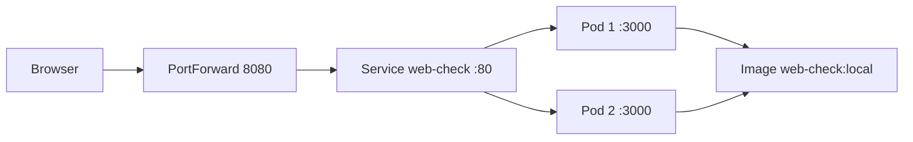

# Präsentation — Web-Check auf Kubernetes

**Dauer:** 10–15 Minuten  
**Team:** lad · lob · las · bls  
**Demo-URL:** http://localhost:8080 (nach `kubectl port-forward svc/web-check 8080:80`)

> Ausführliches Demo-Skript: [DEMO_SKRIPT.md](DEMO_SKRIPT.md)  
> Durchgeführte Arbeit: [RESULTS_lad.md](RESULTS_lad.md) · [RESULTS_lob.md](RESULTS_lob.md) · [RESULTS_las.md](RESULTS_las.md) · [RESULTS_bls.md](RESULTS_bls.md)

---

## Folie 1 — Titelfolie

**Titel:** Web-Check auf Kubernetes  
**Untertitel:** Container, Deployment, Service — Schulprojekt  
**Team:** lad, lob, las, bls  
**Datum:** _______________

**Sprecher:** bls (0:00)

> „Guten Tag. Wir zeigen, wie wir die Open-Source-App Web-Check mit Docker containerisieren und auf Kubernetes betreiben.“

---

## Folie 2 — Was ist Web-Check?

**Inhalt:**
- OSINT-Tool zur Analyse beliebiger Websites
- Tech-Stack: Node.js 22, Express, Astro-Frontend
- Läuft standardmässig auf **Port 3000**
- Nutzt Chromium/Puppeteer für Analysen

**Sprecher:** bls

> „Web-Check sammelt Informationen über Websites — DNS, Headers, Technologien und mehr. Wir haben die App nicht neu geschrieben, sondern für Kubernetes deployt.“

---

## Folie 3 — Warum Container & Kubernetes?

**Inhalt:**

| Ohne K8s | Mit Kubernetes |
|----------|----------------|
| Ein Server, manuell starten | Mehrere Pods, automatisch verwaltet |
| Absturz = Ausfall | Neuer Pod wird gestartet |
| Skalierung manuell | `kubectl scale` |

**Sprecher:** bls → Übergabe an lad

---

## Folie 4 — Docker & Image (lad)

**Inhalt:**
- [`Dockerfile`](Dockerfile): Multi-Stage-Build
- Befehl: `docker build -t web-check:local .`
- Ergebnis: Image **4.45 GB** (Chromium)
- Lokal getestet: http://localhost:3000 → HTTP 302

**Live (optional):**
```bash
docker images | grep web-check
```

**Sprecher:** lad (1:30–3:00)

> „Das Dockerfile packt App und Chromium in ein Image. Das ist die Vorlage für jeden Pod.“

**Referenz:** [RESULTS_lad.md](RESULTS_lad.md)

---

## Folie 5 — Deployment & Pods (lob)

**Inhalt:**
- [`k8s/deployment.yaml`](k8s/deployment.yaml)
- 2 Replicas, Label `app: web-check`
- Ressourcen-Limits: 512Mi–1Gi RAM
- Readiness/Liveness-Probes auf Port 3000

**Live:**
```bash
kubectl get pods -l app=web-check
kubectl describe deployment web-check
```

**Sprecher:** lob (3:00–5:00)

> „Ein Deployment verwaltet Pods. Wir wollen zwei Kopien — Kubernetes hält diese Anzahl stabil.“

**Referenz:** [RESULTS_lob.md](RESULTS_lob.md)

---

## Folie 6 — Service & Zugriff (las)

**Inhalt:**
- [`k8s/service.yaml`](k8s/service.yaml)
- Typ: NodePort (Port 30080) oder Port-Forward
- Service-Port **80** → Container-Port **3000**
- Endpoints: 2 Pod-IPs verbunden

**Live:**
```bash
kubectl get svc web-check
kubectl get endpoints web-check
# Browser: http://localhost:8080
```

**Sprecher:** las (5:00–7:00)

> „Pods haben wechselnde IPs. Der Service ist die feste Anlaufstelle für den Browser.“

**Referenz:** [RESULTS_las.md](RESULTS_las.md)

---

## Folie 7 — Architektur



**Sprecher:** las (12:00–14:00)

> „Der Datenfluss: Browser → Port-Forward → Service → einer der Pods → unser Docker-Image.“

---

## Folie 8 — Live-Demo (bls)

**Ablauf:**
1. Browser: http://localhost:8080 öffnen
2. Domain eingeben: **wikipedia.org**
3. Analyse-Ergebnisse zeigen
4. Terminal: `kubectl logs -l app=web-check --tail=10`

**Sprecher:** bls (7:00–10:00)

> „Die App läuft nicht nur lokal in Docker, sondern im Cluster — hochverfügbar mit zwei Pods.“

---

## Folie 9 — Skalierung (lob)

**Live:**
```bash
kubectl scale deployment web-check --replicas=3
kubectl get pods -w
kubectl scale deployment web-check --replicas=2
```

**Inhalt:**
- Mehr Last → mehr Pods
- Weniger Last → Pods werden entfernt
- Selbstheilung: Pod löschen → neuer Pod

**Sprecher:** lob (10:00–12:00)

> „Mit einem Befehl skalieren wir von zwei auf drei Instanzen — ohne die App neu zu installieren.“

---

## Folie 10 — Lessons Learned & Fazit

**Inhalt:**
- Image ist gross (Chromium) — Build dauert ~7 Min
- Image muss im Cluster verfügbar sein (`kind load` / minikube docker-env)
- Port-Forward ist praktisch für Demos
- Kubernetes-Begriffe: Pod, Deployment, Service

**Sprecher:** bls (14:00–15:00)

> „Wir haben gelernt, wie Container-Images, Deployments und Services zusammenspielen. Kubernetes automatisiert Betrieb und Skalierung.“

---

## Folie 11 — Q&A

**Fragen vorbereiten:**
- Was passiert bei Pod-Absturz? → Neuer Pod
- Unterschied Docker vs. Kubernetes? → Docker = ein Container; K8s = viele Container orchestrieren
- Warum 2 Pods? → Verfügbarkeit, Lastverteilung

**Sprecher:** bls

---

## Kubernetes-Begriffe (Spickzettel)

| Begriff | Kurz erklärt |
|---------|--------------|
| **Image** | Vorlage aus Dockerfile (`web-check:local`) |
| **Pod** | Laufende Instanz des Containers |
| **Deployment** | Verwaltet Anzahl und Updates der Pods |
| **Service** | Stabile Netzwerk-Adresse für Pods |
| **NodePort** | Externer Port auf dem Cluster-Node |
| **Port-Forward** | Lokaler Tunnel zum Service |

---

## Technische Nachweise (bereits erledigt)

| Check | Ergebnis |
|-------|----------|
| `docker build` | Erfolg, 4.45 GB |
| Lokaler Test :3000 | HTTP 302 |
| Pods Running | 2/2 |
| Service Endpoints | 2 IPs :3000 |
| Browser :8080 | HTTP 302 |
| Skalierung 3→2 | Erfolg |

Details in den `RESULTS_*.md`-Dateien.

---

## Setup-Befehle (Handout)

```bash
docker build -t web-check:local .
kind create cluster --name web-check
kind load docker-image web-check:local --name web-check
kubectl apply -f k8s/
kubectl port-forward svc/web-check 8080:80
```

Vollständig: [`k8s/README.md`](k8s/README.md)
