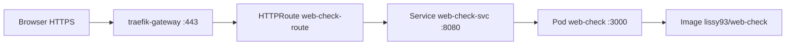

# Präsentation — Web-Check auf Kubernetes

**Dauer:** 10–15 Minuten  
**Team:** lad · lob · las · bls  

**Demo-URL (Präsentation):** **https://course-7.network.garden/check**

**GitHub:** [github.com/leteffe/web-check-k8s](https://github.com/leteffe/web-check-k8s)

> Ausführliches Demo-Skript: [DEMO_SKRIPT.md](DEMO_SKRIPT.md)  
> Deploy auf network.garden: [NETWORK_GARDEN.md](NETWORK_GARDEN.md)  
> Lokal üben (optional): `./start.sh` → http://localhost:8080

---

## Folie 1 — Titelfolie

**Titel:** Web-Check auf Kubernetes  
**Untertitel:** Container, Deployment, Service — Schulprojekt  
**Team:** lad, lob, las, bls  
**GitHub:** [github.com/leteffe/web-check-k8s](https://github.com/leteffe/web-check-k8s)  
**Live:** [course-7.network.garden/check](https://course-7.network.garden/check)  
**Datum:** _______________

**Sprecher:** bls (0:00)

> „Guten Tag. Wir zeigen, wie wir die Open-Source-App Web-Check mit Docker containerisieren und auf Kubernetes betreiben — das Tool findet ihr unter course-7.network.garden/check.“

---

## Folie 2 — Was ist Web-Check?

**Inhalt:**
- OSINT-Tool zur Analyse beliebiger Websites
- Tech-Stack: Node.js 22, Express, Astro-Frontend
- Läuft standardmässig auf **Port 3000**
- Nutzt Chromium/Puppeteer für Analysen

**Sprecher:** bls

> „Web-Check sammelt Informationen über Websites — DNS, Headers, Technologien und mehr. Wir haben die App nicht neu geschrieben, sondern für Kubernetes deployt.“

---

## Folie 3 — Warum Container & Kubernetes?

**Inhalt:**

| Ohne K8s | Mit Kubernetes |
|----------|----------------|
| Ein Server, manuell starten | Pods, automatisch verwaltet |
| Absturz = Ausfall | Neuer Pod wird gestartet |
| Skalierung manuell | `kubectl scale` |

**Sprecher:** bls → Übergabe an lad

---

## Folie 4 — Docker & Image (lad)

**Inhalt:**
- [`Dockerfile`](Dockerfile): Multi-Stage-Build
- Lokal: `docker build -t web-check:local .`
- Auf network.garden: öffentliches Image `lissy93/web-check` (Cluster kann lokale Images nicht pullen)
- Image-Grösse ~4.5 GB (Chromium)

**Live (optional):**
```bash
docker images | grep web-check
```

**Sprecher:** lad (1:30–3:00)

> „Das Dockerfile packt App und Chromium in ein Image. Auf dem Kurs-Cluster nutzen wir ein Image aus der Registry, das jeder Node laden kann.“

**Referenz:** [RESULTS_lad.md](RESULTS_lad.md)

---

## Folie 5 — Deployment & Pods (lob)

**Inhalt:**
- [`k8s/network-garden/deployment.yaml`](k8s/network-garden/deployment.yaml)
- Namespace `lab`, Label `app: web-check`
- Ressourcen-Limits: 512Mi–1Gi RAM
- Readiness/Liveness-Probes auf Port 3000

**Live:**
```bash
export KUBECONFIG=/pfad/zu/course-7.config
kubectl get pods -n lab -l app=web-check
kubectl describe deployment web-check -n lab
```

**Sprecher:** lob (3:00–5:00)

> „Das Deployment startet unsere App als Pod im Cluster. `kubectl get pods` zeigt, ob alles läuft.“

**Referenz:** [RESULTS_lob.md](RESULTS_lob.md)

---

## Folie 6 — Service, HTTPRoute & Zugriff (las)

**Inhalt:**
- [`k8s/network-garden/service.yaml`](k8s/network-garden/service.yaml) — ClusterIP, Port **8080** → **3000**
- [`k8s/network-garden/httproute.yaml`](k8s/network-garden/httproute.yaml) — Host `course-7.network.garden`
- Gateway: `traefik-gateway` (Namespace `traefik`)
- **Kein Port-Forward nötig** — öffentliche HTTPS-URL

**Live:**
```bash
kubectl get svc web-check-svc -n lab
kubectl get httproute web-check-route -n lab
# Browser: https://course-7.network.garden/check
```

**Sprecher:** las (5:00–7:00)

> „Der Service verbindet intern die Pods. Die HTTPRoute leitet von aussen auf course-7.network.garden zu unserem Service — das ist der öffentliche Zugang.“

**Referenz:** [RESULTS_las.md](RESULTS_las.md) · [NETWORK_GARDEN.md](NETWORK_GARDEN.md)

---

## Folie 7 — Architektur

Siehe [KUBERNETES_ARCHITEKTUR.md](KUBERNETES_ARCHITEKTUR.md) für vollständige Diagramme.



**Sprecher:** las (12:00–14:00)

> „Der Datenfluss: Browser → Gateway → HTTPRoute → Service → Pod. Das Tool startet unter /check — die Root-URL leitet dorthin weiter.“

---

## Folie 8 — Live-Demo (bls)

**Ablauf:**
1. Browser: **https://course-7.network.garden/check** öffnen
2. Domain eingeben: **wikipedia.org**
3. Analyse-Ergebnisse zeigen
4. Terminal: `kubectl logs -n lab -l app=web-check --tail=10`

**Sprecher:** bls (7:00–10:00)

> „Die App läuft auf dem Kurs-Cluster — nicht nur lokal auf unserem Laptop, sondern öffentlich über Kubernetes.“

---

## Folie 9 — Skalierung (lob)

**Live:**
```bash
kubectl scale deployment web-check -n lab --replicas=2
kubectl get pods -n lab -w
kubectl scale deployment web-check -n lab --replicas=1
```

**Inhalt:**
- Mehr Replicas → mehr Pods
- Weniger Replicas → Pods werden entfernt
- Selbstheilung: Pod löschen → neuer Pod

**Sprecher:** lob (10:00–12:00)

> „Mit einem Befehl skalieren wir die Instanzen — ohne die App neu zu installieren.“

---

## Folie 10 — Lessons Learned & Fazit

**Inhalt:**
- Remote-Cluster braucht Image aus Registry (nicht `web-check:local`)
- HTTPRoute + Gateway statt Port-Forward für öffentlichen Zugriff
- Team **lad**, **lob**, **las**, **bls** — Code auf [GitHub](https://github.com/leteffe/web-check-k8s)
- Kubernetes-Begriffe: Pod, Deployment, Service, HTTPRoute

**Sprecher:** bls (14:00–15:00)

> „Wir haben gelernt, wie Container-Images, Deployments, Services und HTTPRoutes zusammenspielen — und die App unter course-7.network.garden betreiben.“

---

## Folie 11 — Q&A

**Fragen vorbereiten:**
- Was passiert bei Pod-Absturz? → Neuer Pod
- Unterschied Docker vs. Kubernetes? → Docker = ein Container; K8s = viele Container orchestrieren
- Warum HTTPRoute statt Port-Forward? → Öffentliche Domain ohne lokales Terminal

**Sprecher:** bls

---

## Kubernetes-Begriffe (Spickzettel)

| Begriff | Kurz erklärt |
|---------|--------------|
| **Image** | Container-Vorlage (`lissy93/web-check` auf network.garden) |
| **Pod** | Laufende Instanz des Containers |
| **Deployment** | Verwaltet Anzahl und Updates der Pods |
| **Service** | Stabile Netzwerk-Adresse für Pods (intern) |
| **HTTPRoute** | Leitet externe Domain zum Service (Gateway API) |
| **Gateway** | `traefik-gateway` — HTTPS-Eingang (Port 443) |

---

## Technische Nachweise

| Check | Ergebnis |
|-------|----------|
| Deploy auf course-7 | Pods `Running` in Namespace `lab` |
| HTTPRoute | Host `course-7.network.garden` |
| Browser | https://course-7.network.garden/check lädt |
| Team / Repo | lad, lob, las, bls · github.com/leteffe/web-check-k8s |

Details: [NETWORK_GARDEN.md](NETWORK_GARDEN.md), `RESULTS_*.md`

---

## Setup vor der Präsentation (network.garden)

```bash
export KUBECONFIG=/pfad/zu/course-7.config
kubectl config set-context --current --namespace=lab

kubectl apply -f k8s/network-garden/
kubectl rollout status deployment/web-check -n lab --timeout=180s
kubectl get pods,httproute -n lab -l app=web-check
```

**Browser testen:** https://course-7.network.garden/check

Vollständig: [NETWORK_GARDEN.md](NETWORK_GARDEN.md)

---

## Optional: Lokal üben (nicht für die Live-Präsentation)

```bash
./start.sh
# → http://localhost:8080 (kind + Port-Forward)
```

Siehe [README.md](README.md) und [START_SH.md](START_SH.md).
