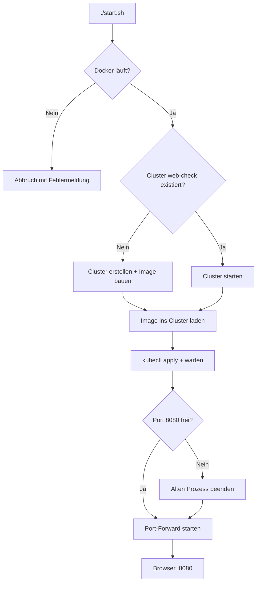

# Was macht `start.sh`?

Dieses Dokument erklärt Schritt für Schritt, was das Skript [`start.sh`](start.sh) beim Ausführen von `./start.sh` tut — und warum.

> Kurzstart: [README.md](README.md)

---

## Übersicht



Das Skript hat **5 Phasen**. Am Ende läuft die App unter http://localhost:8080 — solange das Terminal offen bleibt.

---

## Vorbereitung im Skript

```bash
set -euo pipefail
ROOT="$(cd "$(dirname "$0")" && pwd)"
cd "$ROOT"
```

| Zeile | Bedeutung |
|-------|-----------|
| `set -euo pipefail` | Bei Fehler sofort abbrechen; undefinierte Variablen sind ein Fehler; Fehler in Pipes werden erkannt |
| `ROOT=...` | Projektordner ermitteln (dort liegt `start.sh`) |
| `cd "$ROOT"` | Immer im Repo-Root arbeiten — egal von wo du `./start.sh` aufrufst |

---

## Phase 1/5 — Docker prüfen

```bash
docker info >/dev/null 2>&1
```

**Was passiert:** Das Skript fragt den Docker-Daemon, ob er erreichbar ist.

| Ergebnis | Reaktion |
|----------|----------|
| Docker läuft | Weiter zu Phase 2 |
| Docker läuft nicht | Meldung „Docker Desktop starten“, Skript endet mit Exit 1 |

**Warum:** kind und `docker build` brauchen Docker. Ohne laufenden Daemon kann nichts containerisiert werden.

---

## Phase 2/5 — Kubernetes-Cluster (kind)

```bash
kind get clusters | grep -qx web-check
```

Es gibt zwei Fälle:

### Fall A — Cluster existiert bereits (z. B. nach Neustart)

```bash
docker start web-check-control-plane 2>/dev/null || kind start cluster --name web-check
```

**Was passiert:**
- kind speichert den Cluster als Docker-Container `web-check-control-plane`
- Nach Mac-Neustart ist der Container oft gestoppt — `docker start` oder `kind start cluster` startet ihn wieder
- kubectl kann danach wieder mit dem Cluster sprechen

**Dauer:** wenige Sekunden

### Fall B — Erstes Mal (frischer Klon)

```bash
kind create cluster --name web-check
docker build -t web-check:local .
kind load docker-image web-check:local --name web-check
```

**Was passiert:**

| Befehl | Bedeutung |
|--------|-----------|
| `kind create cluster` | Lokaler Kubernetes-Cluster in einem Docker-Container; kubectl-Context `kind-web-check` wird gesetzt |
| `docker build -t web-check:local .` | Image aus dem [`Dockerfile`](Dockerfile) bauen (Node 22, Chromium, Web-Check-App) |
| `kind load docker-image` | Lokales Image in den kind-Node kopieren — sonst kann Kubernetes es nicht finden (`ImagePullBackOff`) |

**Dauer:** Cluster ~1 Min, Build ~5–10 Min

---

## Phase 3/5 — Image ins Cluster laden

```bash
docker image inspect web-check:local   # existiert das Image?
kind load docker-image web-check:local --name web-check
```

**Was passiert:** Das Image wird erneut in den kind-Cluster importiert.

**Warum jedes Mal?**
- Nach `docker build` (neue Version) muss das Cluster das aktuelle Image kennen
- kind hat einen **eigenen** Image-Store — Images von Docker Desktop sind nicht automatisch im Cluster

Falls `web-check:local` fehlt, baut das Skript es zuerst (`docker build`).

---

## Phase 4/5 — Deploy

```bash
kubectl config use-context kind-web-check
kubectl apply -f k8s/
kubectl wait --for=condition=available deployment/web-check --timeout=180s
kubectl get pods -l app=web-check
```

| Befehl | Bedeutung |
|--------|-----------|
| `use-context kind-web-check` | kubectl spricht mit **unserem** kind-Cluster (nicht einem anderen) |
| `apply -f k8s/` | Wendet [`deployment.yaml`](k8s/deployment.yaml) und [`service.yaml`](k8s/service.yaml) an |
| `wait ... available` | Wartet bis das Deployment bereit ist (max. 3 Min) |
| `get pods` | Zeigt die laufenden Pods (Ziel: 2/2 `Running`) |

**Was Kubernetes dabei macht:**

1. **Deployment** startet 2 Pods mit Container `web-check:local` auf Port 3000
2. **Service** `web-check` verbindet Port 80 intern mit Pod-Port 3000
3. Readiness-Probes prüfen, ob die App HTTP antwortet

`unchanged` bei `kubectl apply` ist normal — die Manifeste sind schon korrekt, nichts muss geändert werden.

---

## Phase 5/5 — Port-Forward

```bash
lsof -ti:8080 | xargs kill    # falls Port belegt
kubectl port-forward svc/web-check 8080:80
```

**Was passiert:**

| Teil | Bedeutung |
|------|-----------|
| `lsof -ti:8080` | Findet Prozess auf Port 8080 (oft alter `kubectl port-forward`) |
| `kill` | Beendet ihn, damit kein „address already in use“ kommt |
| `port-forward svc/web-check 8080:80` | Tunnel: **localhost:8080** → Service Port **80** → Pod Port **3000** |

**Warum Port-Forward?** Der Service ist im Cluster intern. Port-Forward macht ihn auf deinem Mac unter http://localhost:8080 erreichbar — praktisch für Demos und Schulprojekt.

**Wichtig:** Dieser Befehl **blockiert** das Terminal. Mit `Ctrl+C` beendest du den Zugriff; Pods im Cluster laufen weiter.

---

## Was das Skript nicht macht

| Nicht enthalten | Manuell wenn nötig |
|-----------------|-------------------|
| Docker Desktop starten | Vor `./start.sh` von Hand öffnen |
| `kind` / `kubectl` installieren | Siehe [README.md](README.md) |
| Cluster löschen | `kind delete cluster --name web-check` |
| App aus Cluster entfernen | `kubectl delete -f k8s/` |

---

## Typische Ausgabe (erfolgreich)

```
=== 1/5 Docker prüfen ===
=== 2/5 Kubernetes-Cluster (kind) ===
Cluster 'web-check' vorhanden — starte …
=== 3/5 Image ins Cluster laden ===
Image: "web-check:local" with ID "sha256:..." not yet present on node ...
=== 4/5 Deploy ===
deployment.apps/web-check unchanged
service/web-check unchanged
NAME                        READY   STATUS    RESTARTS   AGE
web-check-xxxxx-xxxxx       1/1     Running   0          ...
web-check-xxxxx-xxxxx       1/1     Running   0          ...
=== 5/5 Port-Forward ===

App: http://localhost:8080
Beenden: Ctrl+C

Forwarding from 127.0.0.1:8080 -> 3000
```

---

## Zuordnung zum Team (Schulprojekt)

| Phase | Wer im Projekt | Kubernetes/Docker-Begriff |
|-------|----------------|---------------------------|
| 1–3 | **lad** | Docker Image, in Cluster laden |
| 4 | **lob** + **las** | Deployment (Pods) + Service |
| 5 | **las** | Zugriff von aussen (Port-Forward) |
| Gesamt | **bls** | End-to-End: Browser öffnen und testen |

---

## Siehe auch

- [README.md](README.md) — Schnellstart & Fehlerbehebung
- [k8s/README.md](k8s/README.md) — Manifest-Details
- [k8s/TROUBLESHOOTING.md](k8s/TROUBLESHOOTING.md) — bei Pod-/Image-Fehlern
