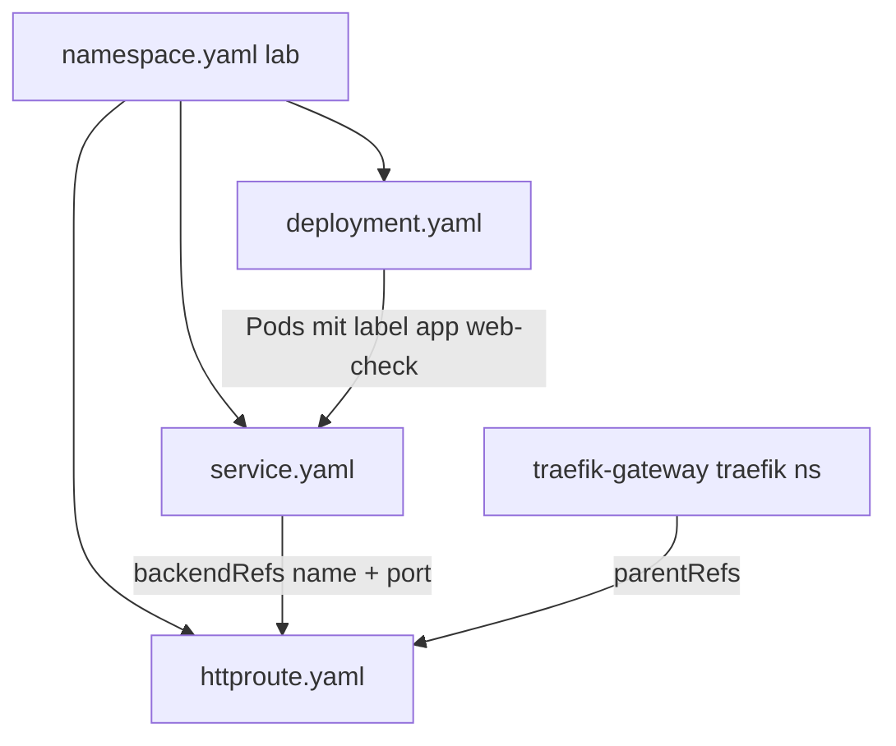

# YAML-Konfiguration — Was steht in welcher Datei?

Referenz aller Kubernetes-Manifeste im Repo: **welche Datei**, **welches Kind**, **welche Felder** konfiguriert sind.

**Team:** lad · lob · las · bls  
Siehe auch: [KUBERNETES_ARCHITEKTUR.md](../KUBERNETES_ARCHITEKTUR.md) (Diagramme)

---

## Übersicht

| Datei | Kind | Umgebung | Verantwortlich |
|-------|------|----------|----------------|
| [`network-garden/namespace.yaml`](network-garden/namespace.yaml) | Namespace | course-7 | las |
| [`network-garden/deployment.yaml`](network-garden/deployment.yaml) | Deployment | course-7 | lob |
| [`network-garden/service.yaml`](network-garden/service.yaml) | Service | course-7 | las |
| [`network-garden/httproute.yaml`](network-garden/httproute.yaml) | HTTPRoute | course-7 | las |
| [`deployment.yaml`](deployment.yaml) | Deployment | lokal (kind) | lob |
| [`service.yaml`](service.yaml) | Service | lokal (kind) | las |

**Deploy course-7:** `kubectl apply -f k8s/network-garden/`  
**Deploy lokal:** `kubectl apply -f k8s/deployment.yaml -f k8s/service.yaml` (via `./start.sh`)

---

## course-7.network.garden — `k8s/network-garden/`

### `namespace.yaml`

```yaml
apiVersion: v1
kind: Namespace
```

| Feld | Wert | Bedeutung |
|------|------|-----------|
| `metadata.name` | `lab` | Alle App-Ressourcen laufen in diesem Namespace |
| `metadata.labels.app` | `web-check` | Label zur Identifikation |

---

### `deployment.yaml`

```yaml
apiVersion: apps/v1
kind: Deployment
```

| Feld | Wert | Bedeutung |
|------|------|-----------|
| `metadata.name` | `web-check` | Name des Deployments |
| `metadata.namespace` | `lab` | Namespace |
| `metadata.labels.app` | `web-check` | Label am Deployment |
| `spec.replicas` | `1` | Eine Pod-Instanz |
| `spec.selector.matchLabels.app` | `web-check` | Welche Pods verwaltet werden |
| `spec.template.metadata.labels.app` | `web-check` | Label an jedem Pod (muss zu Selector passen) |

**Container `web-check`:**

| Feld | Wert | Bedeutung |
|------|------|-----------|
| `containers[].name` | `web-check` | Container-Name im Pod |
| `containers[].image` | `lissy93/web-check:latest` | Image von Docker Hub (Remote-Cluster) |
| `containers[].ports[].containerPort` | `3000` | App-Port (Express/Web-Check) |
| `containers[].ports[].name` | `http` | Port-Name für Probes |

**Ressourcen:**

| Feld | Wert |
|------|------|
| `resources.requests.memory` | `512Mi` |
| `resources.requests.cpu` | `250m` |
| `resources.limits.memory` | `1Gi` |
| `resources.limits.cpu` | `500m` |

**Probes (Health-Checks):**

| Probe | Pfad | Port | initialDelay | period |
|-------|------|------|--------------|--------|
| `readinessProbe` | `/` | `3000` | 20s | 10s |
| `livenessProbe` | `/` | `3000` | 40s | 20s |

→ Pod wird erst `Ready`, wenn HTTP antwortet. Bei Fehler startet Kubernetes den Container neu.

---

### `service.yaml`

```yaml
apiVersion: v1
kind: Service
```

| Feld | Wert | Bedeutung |
|------|------|-----------|
| `metadata.name` | `web-check-svc` | Service-Name (wird in HTTPRoute referenziert) |
| `metadata.namespace` | `lab` | Namespace |
| `metadata.labels.app` | `web-check` | Label |
| `spec.type` | `ClusterIP` | Nur intern im Cluster (kein externer Port) |
| `spec.selector.app` | `web-check` | Leitet Traffic an Pods mit diesem Label |
| `spec.ports[].name` | `http` | Port-Name |
| `spec.ports[].port` | `8080` | Service-Port (HTTPRoute `backendRefs` nutzt diesen) |
| `spec.ports[].targetPort` | `3000` | Weiterleitung zum Container-Port |
| `spec.ports[].protocol` | `TCP` | Protokoll |

**Port-Kette:** HTTPRoute `:8080` → Service → Pod `:3000`

---

### `httproute.yaml`

```yaml
apiVersion: gateway.networking.k8s.io/v1
kind: HTTPRoute
```

| Feld | Wert | Bedeutung |
|------|------|-----------|
| `metadata.name` | `web-check-route` | Name der Route |
| `metadata.namespace` | `lab` | Namespace |
| `metadata.labels.app` | `web-check` | Label |

**Gateway-Anbindung:**

| Feld | Wert | Bedeutung |
|------|------|-----------|
| `spec.parentRefs[].name` | `traefik-gateway` | Gateway im Kurs-Cluster (vorgegeben) |
| `spec.parentRefs[].namespace` | `traefik` | Namespace des Gateways |

**Routing-Regeln:**

| Feld | Wert | Bedeutung |
|------|------|-----------|
| `spec.hostnames[]` | `course-7.network.garden` | Nur Anfragen an diese Domain |
| `spec.rules[].matches[].path.type` | `PathPrefix` | Pfad-Matching-Typ |
| `spec.rules[].matches[].path.value` | `/` | Alle Pfade unter `/` (inkl. `/check`) |
| `spec.rules[].backendRefs[].name` | `web-check-svc` | Ziel-Service |
| `spec.rules[].backendRefs[].port` | `8080` | Service-Port (nicht 3000!) |

**Ergebnis:** `https://course-7.network.garden/check` → Gateway → HTTPRoute → Service → Pod

---

## Lokal (kind) — `k8s/`

### `deployment.yaml`

```yaml
apiVersion: apps/v1
kind: Deployment
```

| Feld | Wert | Unterschied zu network-garden |
|------|------|-------------------------------|
| `metadata.name` | `web-check` | Gleich |
| `metadata.namespace` | *(keins)* | → `default` |
| `spec.replicas` | `2` | Zwei Pods (Hochverfügbarkeit-Demo) |
| `containers[].image` | `web-check:local` | Selbst gebautes Image |
| `containers[].imagePullPolicy` | `IfNotPresent` | Nutzt lokales Image aus kind |
| `containers[].ports[].containerPort` | `3000` | Gleich |
| `resources` | 512Mi–1Gi / 250m–500m | Gleich |
| `readinessProbe` | `/` :3000, delay 15s | Etwas kürzere Delays |
| `livenessProbe` | `/` :3000, delay 30s | Etwas kürzere Delays |

---

### `service.yaml`

```yaml
apiVersion: v1
kind: Service
```

| Feld | Wert | Unterschied zu network-garden |
|------|------|-------------------------------|
| `metadata.name` | `web-check` | Anderer Name |
| `metadata.namespace` | *(keins)* | → `default` |
| `spec.type` | `NodePort` | Externer Port auf dem Node |
| `spec.selector.app` | `web-check` | Gleich |
| `spec.ports[].port` | `80` | Service-Port |
| `spec.ports[].targetPort` | `3000` | Container-Port |
| `spec.ports[].nodePort` | `30080` | Fester NodePort (30000–32767) |

**Zugriff lokal:** `kubectl port-forward svc/web-check 8080:80` → http://localhost:8080

---

## Vergleich: gleiches Konzept, andere Werte

| Konfiguration | network-garden | lokal (kind) |
|---------------|----------------|--------------|
| Namespace | `lab` | `default` |
| Deployment-Name | `web-check` | `web-check` |
| Replicas | `1` | `2` |
| Image | `lissy93/web-check:latest` | `web-check:local` |
| Service-Name | `web-check-svc` | `web-check` |
| Service-Typ | `ClusterIP` | `NodePort` |
| Service-Port | `8080` | `80` |
| targetPort | `3000` | `3000` |
| Externer Zugriff | HTTPRoute | Port-Forward / NodePort |
| HTTPRoute | ja | nein |

---

## Abhängigkeiten zwischen den YAMLs



**Reihenfolge beim Apply:** Namespace zuerst (oder alles mit `kubectl apply -f k8s/network-garden/` — Kubernetes erstellt Namespace vor den anderen Ressourcen im selben Lauf).

---

## Schnell-Check nach dem Apply

```bash
# course-7
export KUBECONFIG=/pfad/zu/course-7.config
kubectl get -f k8s/network-garden/namespace.yaml
kubectl get -f k8s/network-garden/deployment.yaml
kubectl get -f k8s/network-garden/service.yaml
kubectl get -f k8s/network-garden/httproute.yaml

# lokal
kubectl get -f k8s/deployment.yaml
kubectl get -f k8s/service.yaml
```

---

## Siehe auch

- [KUBERNETES_ARCHITEKTUR.md](../KUBERNETES_ARCHITEKTUR.md) — Diagramme & Ablauf
- [NETWORK_GARDEN.md](../NETWORK_GARDEN.md) — Deploy course-7
- [k8s/README.md](README.md) — Befehle
